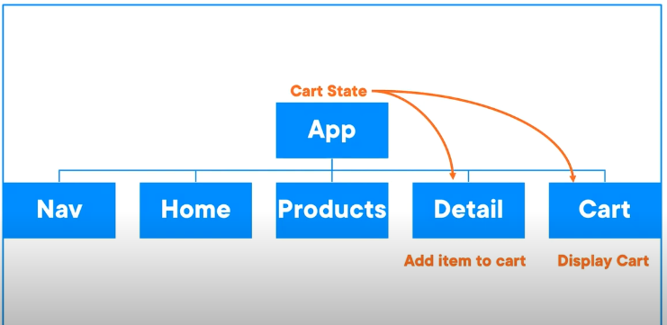

# A MOCK PROJECT
this application is served using firebase on https://shoe-store-mock.web.app/
the mock server used to serve the data is deployed on vercel with https://mock-json-server-psi.vercel.app
the endpoints include https://mock-json-server-psi.vercel.app/products
a ci/cd pipeline is also build for this application using a github workflow

- you can view the shoes available
- you can view each shoe
- you can also add each shoe to cart
- and you can remove item from the cart

*of course, there is still a lot to do - but i am not stopping!... lol*

## MANAGING STATE IN REACT
While building the application, i have learnt alot on state manaement in react
## MANAGING ROUTER STATE
- Declare routes via <Route>
- Declare and read dynamic URL placeholders
- use Link instead of html anchor tag
- handled 404s
- used the useParameter hook
- redirected using useNavigate -> handles client-side navigation programmatically

## Handling Shared, Derived and Immutable State

## Deciding where to declare the cart state since multiple components needs it. USE THE PRINCIPLE OF LEAST PRIVILEDGE
Principle of Least Priviledge - every module must be able to access only the information and resources that are necessary for its legitimate purpose.

common mistake
declaring state in the wrong spot.

KEEP STATE AS LOCAL AS POSSIBLE.

Best principles for keeping state - START LOCAL
1. declare state in the component that needs it
2. if child components need the state?. pass the state down via props.
3. if non-child components need it, then lift state to a common parent
4. BUT NOTE, TO AVOID PROP DRILLING, THEN CONSIDER CONTEXT, REDUX

***LIFTING STATE***

### REACT SET STATE CALLS ARE ASYNCHRONOUS
*We need to update state using existing state. So we sould use a function to set state*
react set state calls do not happen immediately
react batch calls its state.

batching improves performace by reducing re-renders
this means that if state is set multiple times in a short time period, React may batch the updates.

THEREFORE, THIS IS UNRELIABLE
const [count, setCount] = useState();
setCount(count + 1); => this is unreliable due to batching

better still
setCount((count) => count + 1)
*IT IS IMPORTANT TO TREAT STATE AS IMMUTABLE IN REACT*
#### WHY IMMUTABILITY
helps write pure functions
simpler for undo and redo
helps avoid bugs

**IF THE OLD AND NEW STATE REFERENCES THE SAME OBJECT IN MEMORY, THEN THE STATE HAS NOT CHANGED!!!**

METHODS TO COPY STATE - MAKING IT IMMUTABLE
1. Object.assign({}, state, {role:"admin"})
2. const newState = {...state, role:"admin"}
    WARNING:
        be careful, because the above does not clone nested addresses.
3. map, filter, reduce, etc
BUT ONLY CLONE WHAT CHANGES IN STATE:
- deep cloining is expensive

arrays to avoid in react
- push
- pop
- reverse

arrays to prefer
- map, filter, reduce, concat, spread

When you update state using the useState setter function (setCart), you can pass:
1. A new value → setCart(newArray)
2. A function → setCart((prevState) => newArray)

### using useMemo()
to optimize performance, i could save my calculations using useMemo()
with useMemo(), the value would only be re-calculated if the dependency is changed.
DO NOT ALSO FORGET THAT HOOKS CAN NOT BE CALLED CONDITIONALLY

### lazy initializing state
how do i store my data so that it persists even during page reloads.
#### Web storage
- cookie
- localStorage
- sessionStorage
- IndexedDb
- Cache Storage

Advantages
- local, simple, fast, works offline
Disadvantages
- limited storage, localstorage block I/O, tied to single browser, security risk

##### local storage
setItem, getItem, removeItem
**nullish coalescing operator**

SUMMARY
- use derive state when possible.
- lift state to share it accross components
- react state is async and batched.

## HANDLING FORM STATE
**with functional set state, react deletes the event before we can access it. does this make sense**
In functional components, setState is asynchronous, meaning React schedules the state update but doesn't immediately apply it. So if you're trying to access the state or event before the update is reflected, you'll likely encounter an issue.
**Although, with react 17 or newer, the above error might not occur since it no longer pools events**
### FORM VALIDATION DECISIONS
1. WHERE do i display the errors
    by field, at top
2. WHEN do i display the errors
    onSubmit, onBlur, onChange
3. WHEN do i disable submit button - when the form is invalid?
    until clean, submitting, never
4. WHEN do i revalidate
    onSubmit, onCHange, onBlur

WHAT STATE DO WE NEED TO DECLARE (during form validation)
- touched *what fields have been touched* on fields that there is focus on. **variable: touched**
- submitted *has the form been submitted* **variable: status**
- isSubmitting *is the form submission in progress* **variable: status**
- isValid *is the form currently valid***variable: derived from others**
- errors *what are the errors for each field***variable: derived from others**
- dirty *has the form changed***variable: derived from others**
#### how do i use a single piece of state - status to track if the form has been submitted or is still submitting
**THE STATE ENUM PATTERN** => FAVOUR ENUMS OVER SEPARATE BOOLEANS
Implement an enum data type in javscript using an object.
an enum is simply a list of options.
handling discrete states as a single piece of state.
*principle of least priviledge = components should only be provided what they need to get the job done!*

If you have separate booleans, and only one can be true at a time, then consider declaring a single status variable.

DOES MY LOGIC HAVE DISCRETE STATES? then use a single state variable - enum

a more complex solution is A FINITE STATE MACHINE.
only one state can be active at the same time.
XState is a very cool library
XState is a library for implementing finite state machine
- helps enforce state transitions
    declare how and when app moves between states
    prevents invalid transitions.
- it provides state charts.

BUT THE ENUM PATTERN IS A SIMPLER ALTERNATIVE TO A FINITE STATE MACHINE LIBRARY

*one common mistake with form validation is to declare too much state. most form state can be derived.*

## USING REFS
What is Ref?
1. Reference an HTML element
2. Store a value that is stable between renders. it persists value between renders
3. Unlike state, refs value can be mutated directly
4. Unlike state, refs does not cause re-renders when they change

WHEN TO USE REF
1. When i need a reference to a DOM element
2. when i have state that does not render/ does not change
3. useful as instance variables in function components
    with refs, i can do the following
        - keep data between renders
        - store a pervious value
        - track if the component is mounted
        - hold HTTP request cancel token
        - reference a 3rd party library instance
        - debounce a call / declare local cache
        - store flag that something happened
        - store value used in useEffect
